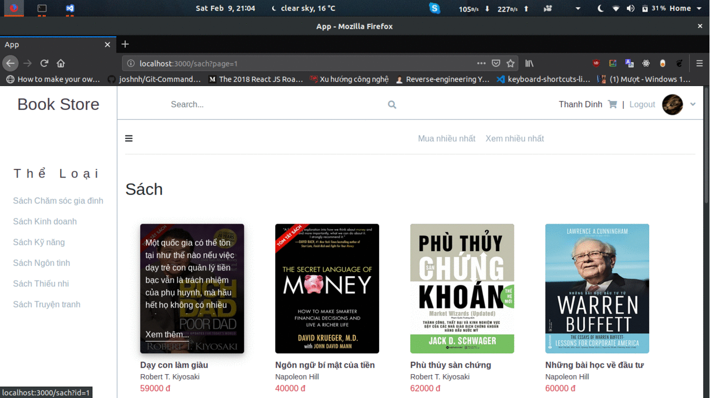

# App Đặt Sách Online (Client side)
> Đồ án cuối kỳ web 1 viết bằng php (server side) và javascript (client side)

## Kiến trúc
Mô hình 3 lớp

## Công nghệ sử dụng
- Webpack dùng để đóng gói files
- Ajax dùng để gọi Apis
- Chức năng phân trang
- Quản lý package và scripts với npm

## Chay thử chương trình (Môi trường dev)
- Setup csdl và chạy server
- Chạy server trên webpack bằng lệnh: npm run dev
- Truy cập localhost:3000 để test ứng dụng

## Thực hiện
**Thanh Dinh**
